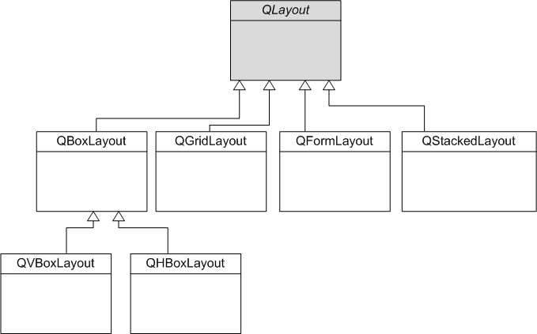
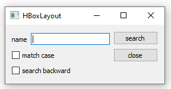
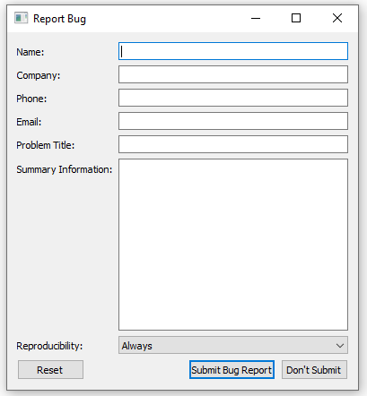
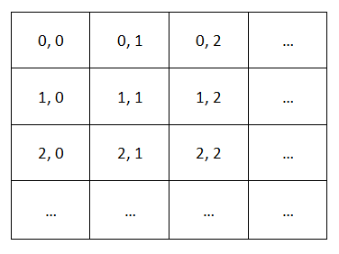
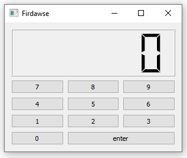

# Programming Widget Layout

>This Practical course covers basic usage of widgets and layouts, showing how they are used to build GUI applications.

FIRST, let's introduce some fundamental concepts 

* **widgets :** 

Widgets are the basic building blocks of graphical user interface (GUI) applications made with Qt. Each GUI component, such as a button, label or text editor, is a widget and can be placed within an existing user interface or displayed as an independent window. Each type of component is provided by a particular subclass of QWidget, which is itself a subclass of QObject.  

---

To intelligently position our widgets, we will use Qt classes managing **layouts**.
For example, there are classes that manage the horizontal and vertical positioning of widgets  or even grid positioning.
>So that you can see it more clearly, I suggest you look at the following diagram .



We will study each of these classes in this lab, with the exception of QStackedLayout (management of widgets on several pages) which is a little too complex.


---
<br>

 **To be familiar with these concepts LET'S HAVE SOME PRACTICE  
 we will work on 4 forms**
 * Experimenting with QHBOXLayout
 * Nested Layouts
 * Bug report Form
 * Grid Layout


___
<br>

> ## Experimenting with QHBOXLayout 
<br>
The QHBoxLayout is used to construct horizontal box layout objects for examples :
 
 <br>
<br>

 

* .h
``` c++
 class dialog : public QWidget
{
public:
    explicit dialog(QWidget*parent=nullptr);
protected:
    void creatWidgets();
    void placeWidgets();
protected:
    QLineEdit*edit;
    QLabel*label;
    QPushButton*search;
};

```
 * .cpp
 ``` c++
 dialog::dialog(QWidget *parent):QWidget(parent)
{
   creatWidgets();
   placeWidgets();

}
void dialog :: creatWidgets()
{
    label =new QLabel("name");
    search =new QPushButton("search");
    edit =new QLineEdit;
    this->setWindowTitle("HBoxLayout");  
};
void dialog :: placeWidgets()
 { auto layout = new QHBoxLayout;
   this->setLayout(layout);
   layout->addWidget(label);
   layout->addWidget(edit);
   layout->addWidget(search);
 };
 ```
> ## Nested Layouts
<br>
I think it's important that we take a look at Combination Layouts, a feature that will make us understand the power of layouts

Just as widgets can contain other widgets, layouts can be used to provide different levels of grouping for widgets. This is where the magic appears ! 

Here, we want to display a classic dialog from the book GB to search for a user.


 


* .h

```cpp
class dialog2: public QWidget
{
public:
    explicit dialog2(QWidget*parent=nullptr);
protected:
    void creatWidgets();
    void placeWidgets();
protected:
    QLineEdit*edit;
    QLabel*label;
    QPushButton*search;
    QCheckBox*b1;
    QCheckBox*b2;
    QPushButton*close;
};
 ```

* .cpp
```cpp
dialog2::dialog2(QWidget *parent):QWidget(parent)
{creatWidgets();
 placeWidgets();
}
void dialog2 :: creatWidgets()
{
    label =new QLabel("name");
    search =new QPushButton("search");
    close =new QPushButton("close");
    b1 =new QCheckBox("match case");
    b2=new QCheckBox("search backward");
    edit =new QLineEdit;
    this->setWindowTitle("HBoxLayout");
};
void dialog2 :: placeWidgets()
{ auto Mainlayout = new QHBoxLayout;
      auto topleftlayout = new QHBoxLayout;
      topleftlayout->addWidget(label);
      topleftlayout->addWidget(edit);
      auto leftlayout = new QVBoxLayout;
      leftlayout->addLayout(topleftlayout);
      leftlayout->addWidget(b1);
      leftlayout->addWidget(b2);
      auto rightlayout = new QVBoxLayout;
      rightlayout->addWidget(search);
      rightlayout->addWidget(close);
      rightlayout->addStretch(7);
      Mainlayout->addLayout(leftlayout);
      Mainlayout->addLayout(rightlayout);
      this->setLayout(Mainlayout);
};
```
we have added a vertical space (Stretch) using addstretch() method with a stretch factor that applies only in the direction of the QBoxLayout, and is relative to the other boxes and widgets in this QBoxLayout. Widgets and boxes with higher stretch factors grow more.

If the stretch factor is 0 and nothing else in the QBoxLayout has a stretch factor greater than zero, the space is distributed according to the QWidget:sizePolicy() of each widget that's involved.

<br>

> ## Bug Report Form
<br>
As another application of layout the following form use QFormLayout which is a convenience layout class that lays out its children in a two-column form. The left column consists of labels and the right column consists of "field" widgets (line editors, spin boxes, etc.).
<br>

Using a QFormLayout is very easy. The difference is that instead of using an addWidget method, we're going to use an addRow method which takes two parameters:

  the text of the label;

  a pointer to the form field.


 let's try to create this bug report : 

 <br>



<br>

* .h
``` c++
class bugreport : public QWidget{
    Q_OBJECT
  public:
//constructor
    bugreport(QWidget *parent = nullptr);
    void createWidgets();
    void positionWidgets();

  private:
//initialization
    QLineEdit* nameEdit ;
    QLineEdit* companyEdit ;
    QLineEdit* phoneEdit ;
    QLineEdit* emailEdit ;
    QLineEdit* problemEdit ;
    QTextEdit* summaryEdit ;
    QComboBox* reproducibilityCombo;
    QDialogButtonBox* buttonBox;
};
```
* .cpp
``` c++
void bugreport::createWidgets(){
//creating lineEdits
    nameEdit = new QLineEdit;
    companyEdit = new QLineEdit;
    phoneEdit = new QLineEdit;
    emailEdit = new QLineEdit;
    problemEdit = new QLineEdit;
    summaryEdit = new QTextEdit;
//creating the comboBox
    reproducibilityCombo = new QComboBox;
    reproducibilityCombo->addItem("Always");
    reproducibilityCombo->addItem("Sometimes");
    reproducibilityCombo->addItem("Rarely");
//creating button box
    buttonBox = new QDialogButtonBox;
    buttonBox->addButton("Submit Bug Report",
                         QDialogButtonBox::AcceptRole);
    buttonBox->addButton("Don't Submit",
                         QDialogButtonBox::RejectRole);
    buttonBox->addButton(QDialogButtonBox::Reset);
}
void bugreport::positionWidgets(){
//setting the form layout
    QFormLayout *layout = new QFormLayout;
            layout->addRow("Name:", nameEdit);
            layout->addRow("Company:", companyEdit);
            layout->addRow("Phone:", phoneEdit);
            layout->addRow("Email:", emailEdit);
            layout->addRow("Problem Title:", problemEdit);
            layout->addRow("Summary Information:",
                           summaryEdit);
            layout->addRow("Reproducibility:",
                           reproducibilityCombo);
//setting the main layout
            QVBoxLayout *mainLayout = new QVBoxLayout;
            mainLayout->addLayout(layout);
            mainLayout->addWidget(buttonBox);
            setLayout(mainLayout);
}
bugreport::bugreport(QWidget* parent):QWidget(parent){
//calling the methods
    createWidgets();
    positionWidgets();
    setWindowTitle("Report Bug");
  }
```

> ## Grid Layout

<br>
the horizontal and vertical layouts are nice but it does not allow you to create very complex layouts on your window.

This is where QGridLayout comes in, which is actually a bit of an assembly of QHBoxLayout andQVBoxLayout. It is  like a table with rows and columns.

You have to imagine that your window can be cut out in the form of a grid with an infinity of boxes, as in the following figure.



let's make things concrete !




* .h  

``` c++
class calculator : public QWidget
{
public:
  //constructor
    calculator(QWidget *parent = nullptr);
    void creatingWdgets();
    void positionWidgets();

private:
  QPushButton *buttons[10];
  QPushButton *bEnter;
  QLCDNumber *label;
  QVBoxLayout *mainLayout;
  QGridLayout *grid;

};
```
* .cpp  

``` c++
void calculator ::creatingWdgets(){
    for(int i=0;i<10;i++){
       QString s = QString::number(i);
        buttons[i]=new QPushButton(s);
    }
    bEnter =new QPushButton("enter");
    label= new QLCDNumber();

}
void calculator :: positionWidgets(){
   mainLayout = new QVBoxLayout();
   grid = new QGridLayout();

   int k = 1;
   for(int i=2;i>=0;i--){
       for(int j=0;j<3;j++){
        grid->addWidget(buttons[k],i,j);
        k++;
       }
   }
    label->setMinimumHeight(80);
    label->setDigitCount(6);
    grid->addWidget(buttons[0],3,0);
    grid->addWidget(bEnter,3,1,1,2);
    mainLayout->addWidget(label);
    mainLayout->addLayout(grid);
    resize(300,300);
    setLayout(mainLayout);
}
calculator::calculator(QWidget* parent):QWidget(parent)
{
creatingWdgets();
positionWidgets();
}
```

<br>

   thanks to the layouts, the effort is reduced and the fun is assured; but to be honest, it's boring to have static applications,isn't it ?
   so see you in our next session full of connextions !


